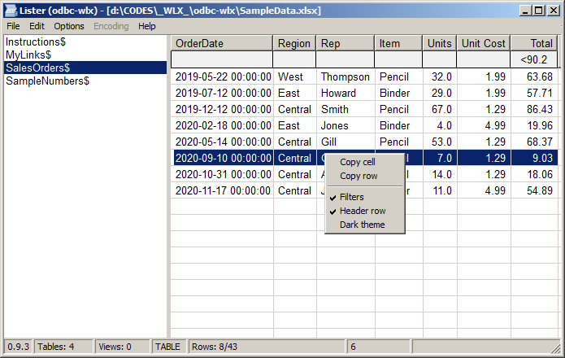

**odbc-wlx** is a [Total Commander](https://www.ghisler.com/) plugin to view Access (\*.mdb, \*.accdb), Excel (\*.xls, \*.xlsx, \*.xlsb) and Data Source (\*.dsn) files through ODBC interface.
Check [Wiki](https://github.com/little-brother/odbc-wlx/wiki) if you have trouble viewing the files. 

|[**Download the latest version**](https://github.com/little-brother/odbc-wlx/releases/latest/download/odbc-wlx.zip)|
|-------------------------------------------------------------------------------------------|

### Features
* Column filters
* Sort data by column click

If you have any problems, comments or suggestions, check [Wiki](https://github.com/little-brother/odbc-wlx/wiki), create [issue](https://github.com/little-brother/odbc-wlx/issues) or just let me know <a href="mailto:lb.im@ya.ru?subject=odbc-wlx">lb.im@ya.ru</a>.